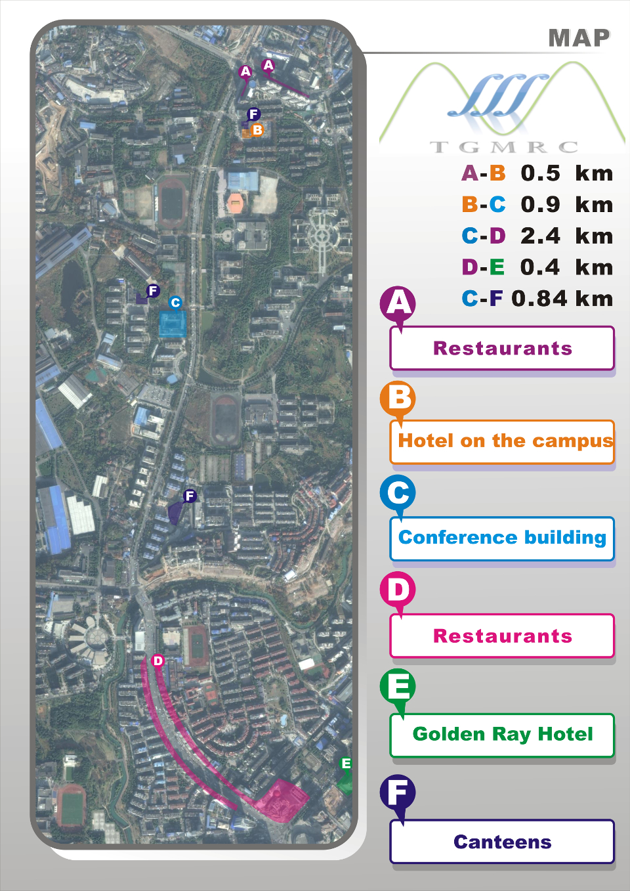

# Design Theory from the Viewpoint of Algebraic Combinatorics

Oct. 14 - Oct. 21, [Three Gorges Mathematical Research Center (TGMRC)](http://mathcenter.ctgu.edu.cn/), [China Three Gorges University (CTGU)](http://www.ctgu.edu.cn/)

[Home](.) || [Schedule](schedule) || [Participants](participants) || **Map**

